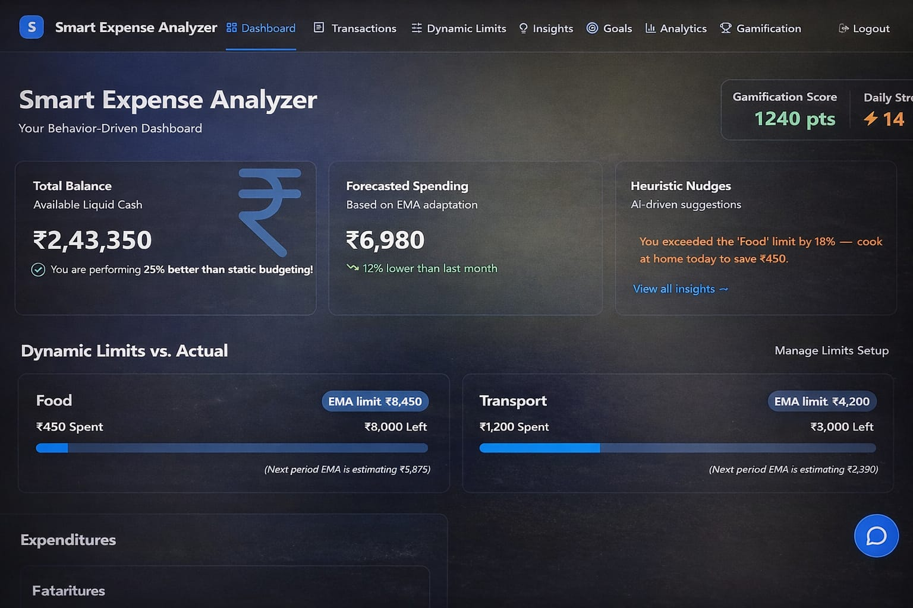
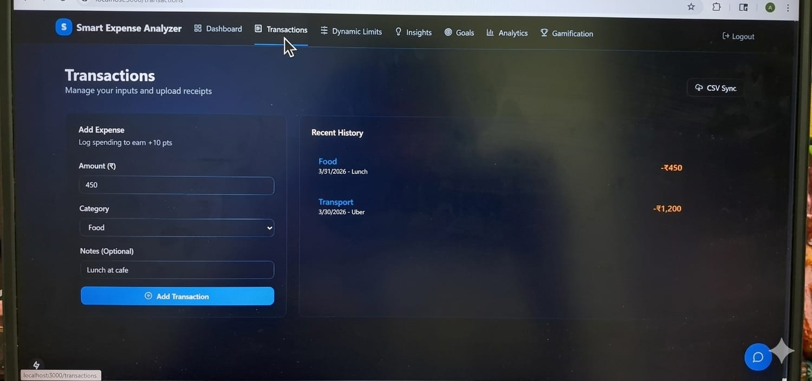
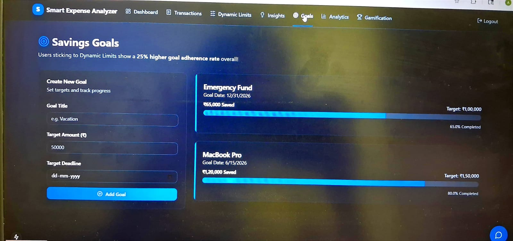
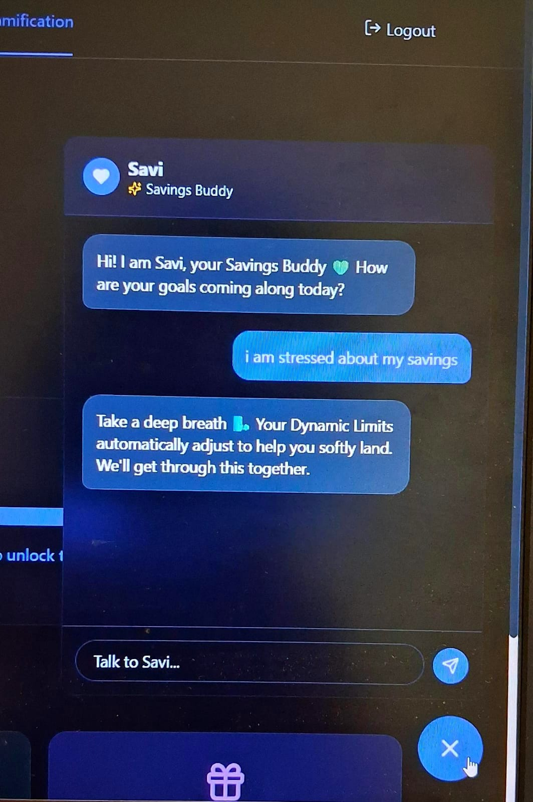
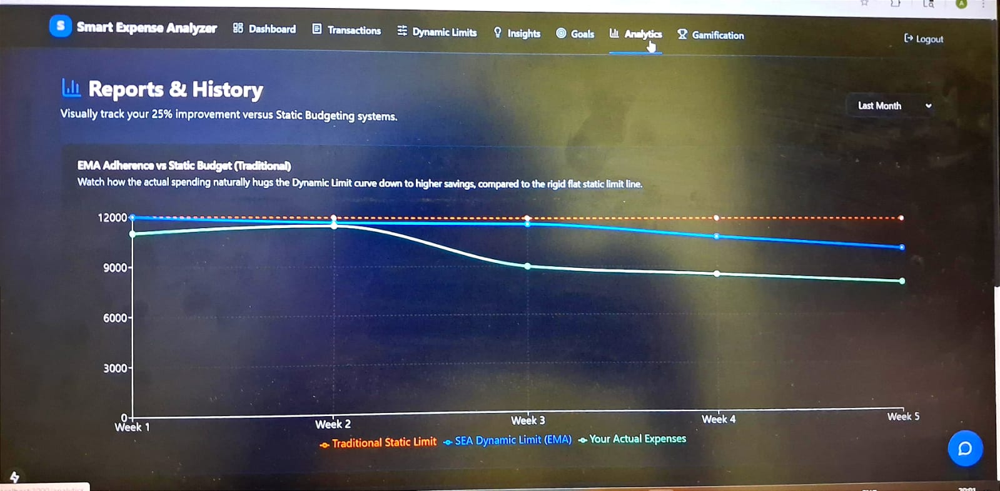

# 💰 Smart Expense Analyzer
> AI-powered personal finance tracker that improves spending habits, not just tracks them.

## 💡 What makes this different?

*  A chatbot (**Savi**) that doesn’t just give financial tips, but also helps you stay calm and consistent
* Goal tracking with a bit of gamification to keep things motivating
*  Insights that actually make sense, not just numbers on a screen

---
## 🛠 Tech Stack

- ⚛️ Next.js (App Router)
- 🟦 TypeScript
- 🎨 Tailwind CSS
- 📊 Data Visualization (Charts)
- 🤖 AI Chatbot (Savi)

  
### Preview
### 📊 Dashboard  
Overview of balance, expenses, and activity  

  

---

## 📌 About the Project

Smart Expense Analyzer is a behavior-driven finance app that helps users:
- Track expenses
- Understand spending patterns
- Improve financial habits using AI insights

💡 **Why I built this:**
I noticed that many students (including myself at times) struggle to stay consistent with managing expenses. Existing apps felt too mechanical. So I tried building something that feels a bit more supportive and practical.

---

## 🚀 Features

*  Dashboard with balance, income, expenses, and streak tracking
*  Easy expense and transaction tracking
*  Simple insights to understand spending habits
*  Goal setting with a gamified touch
*  AI chatbot (Savi) for guidance and motivation
*  Monthly summaries with personalized feedback

---

## 🧠 What stands out

* Focuses on both **money management and user mindset**
* Includes a chatbot to make the experience more interactive
* Built with a clean and scalable structure
* Combines practical features with a slightly more human approach

---

## 📸 Feature Showcase

### 💸 Transactions  
Track and manage daily expenses  

  

---

### 🎯 Goals & Dynamic Limits  
Set savings goals and control spending  

  

---

### 🤖 AI Chatbot (Savi)  
Provides financial guidance and motivation  

  

---

### 📈 Analytics & Insights  
Visual representation of spending patterns  

  

---

## 🤖 About Savi (Chatbot)

Savi is designed to act like a small “support system” inside the app.

* 💬 Gives financial suggestions
* 🧠 Helps users stay calm about money-related stress
* 📊 Encourages better spending habits
* 🤝 Acts like a savings companion

---
## 🚧 Challenges I faced

* Figuring out how to show insights that are actually useful (not just graphs)
* Making the chatbot feel helpful instead of robotic
* Organizing the project in a scalable way
* Balancing UI design with clarity and usability

---

## 🎯 Impact

* Makes it easier to understand where money is going
* Encourages better habits over time
* Adds a bit of emotional support to financial decision-making

---

## 🔮 What I’d improve next

* Real-time alerts for spending patterns
* Smarter and more personalized chatbot responses
* Better prediction features for future expenses

---

## 📌 Resume-ready points

- Built a full-stack finance app using Next.js & TypeScript
- Designed interactive dashboards for financial insights
- Integrated AI chatbot for user engagement
- Implemented scalable and reusable architecture
---

## 👩‍💻 Author
 Anson Jolly 
Data Science Student
